# Letter zones — approved plain grids

Each letter is one grid: two to three columns (five for w), two to four rows, every line running the full way across. Numbered cells are the ones the pen must pass through, in order. Hatched cells are where the letter does not go.

Reviewed and approved 2026-09-23. `f` is unchanged from the app's existing grid. `h` and `n` were redesigned and approved 2026-09-25 (issues #157 and #158) so that every downstroke must reach the baseline.

## a — 6 zones, 1 stroke

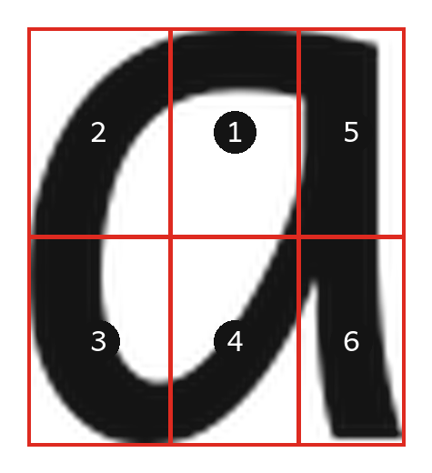

Start at the top of the round part, sweep anticlockwise round it, then up the stem and down again.

## b — 7 zones, 2 strokes

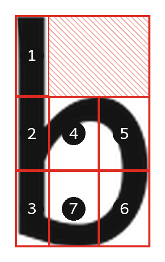

Stroke one: straight down the stem. Stroke two: from the middle of the stem, out across the top of the bowl, down the right-hand side, and back along the bottom to the stem.

## c — 5 zones, 1 stroke

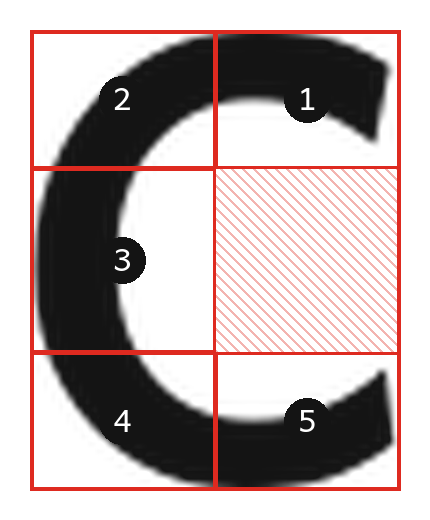

Start top right, over the top, down the left, round the bottom, finish bottom right.

## d — 7 zones, 2 strokes

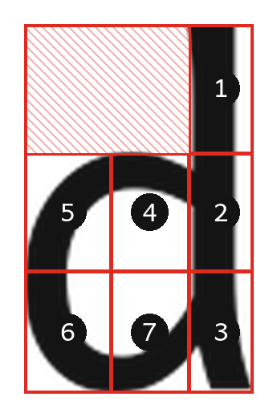

Stroke one: down the stem. Stroke two: from the stem out across the top of the bowl, down the left, back along the bottom to the stem.

## e — 9 zones, 1 stroke

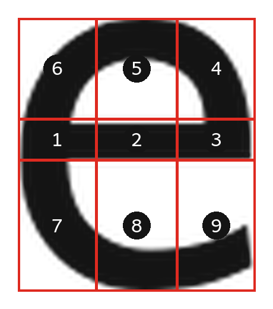

Start at the left of the crossbar, along it to the right, up and over the top, down the left, along the bottom, finish bottom right.

## g — 8 zones, 1 stroke

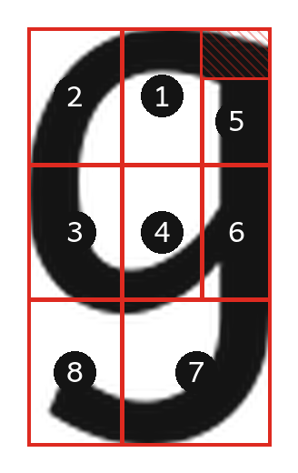

Reading of the hand-drawn 8-section g. Single continuous stroke: bowl anticlockwise, up the right side, down the descender, hook left.

## h — 5 zones, 2 strokes

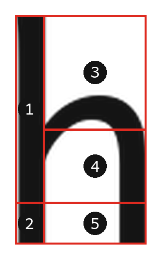

Stroke one: down the stem, all the way to the baseline. Stroke two: from the stem up and over the arch, down the right side, all the way to the baseline. The short bottom row (zones 2 and 5) means neither stroke can stop early.

## i — 3 zones, 2 strokes

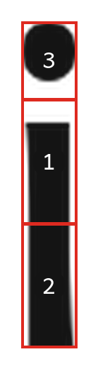

Stroke one: stem, top to bottom. Stroke two: the dot.

## j — 4 zones, 2 strokes

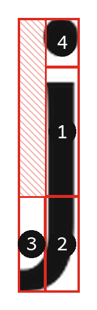

Stroke one: down the stem, then the hook curling left at the bottom. Stroke two: the dot.

## k — 7 zones, 2 strokes

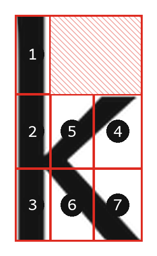

Stroke one: down the stem. Stroke two: in from the upper right to the stem, then out to the lower right.

## l — 3 zones, 1 stroke

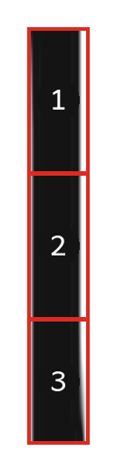

Straight down.

## m — 6 zones, 1 stroke

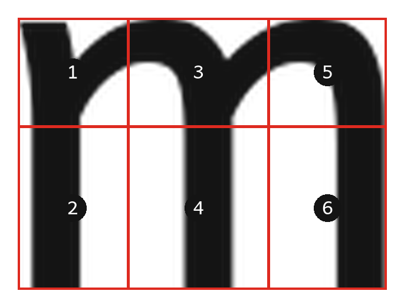

Down the first leg, up and over the first arch, down, up and over the second arch, down.

## n — 5 zones, 1 stroke

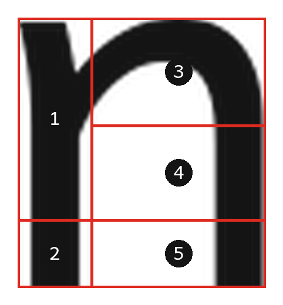

Down the stem all the way to the baseline, back up, over the arch, down the right side all the way to the baseline. The short bottom row (zones 2 and 5) means neither downstroke can stop early.

## o — 6 zones, 1 stroke

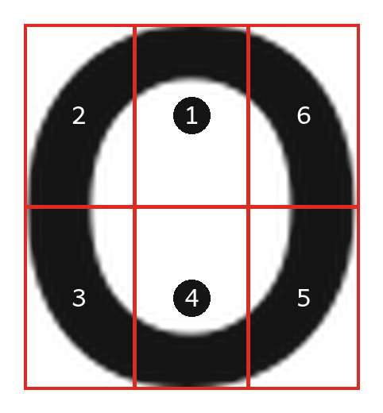

anticlockwise from the top

## p — 7 zones, 2 strokes

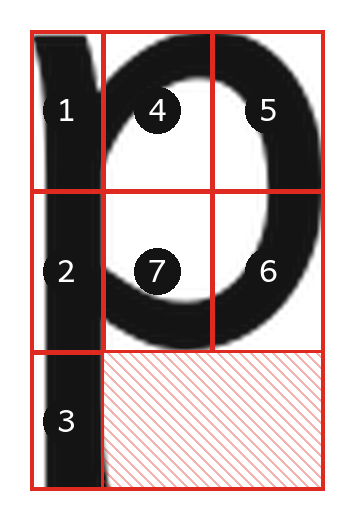

Stroke one: down the stem, below the line. Stroke two: from the stem across the top of the bowl, down the right, back along the bottom.

## q — 7 zones, 2 strokes

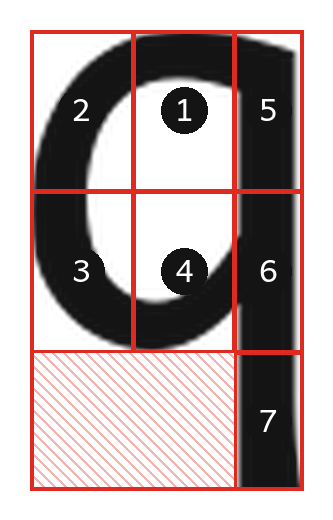

Stroke one: the oval, anticlockwise from the top. Stroke two: the stem, straight down below the line.

## r — 4 zones, 2 strokes

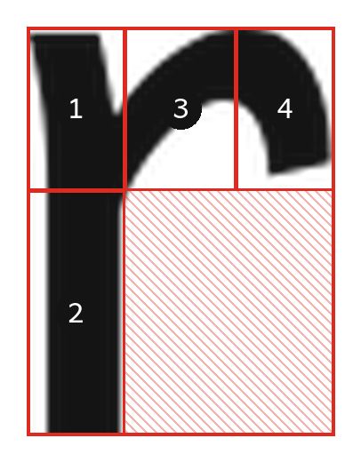

Stroke one: down the stem. Stroke two: the shoulder, up out of the stem and over to the right.

## s — 6 zones, 1 stroke

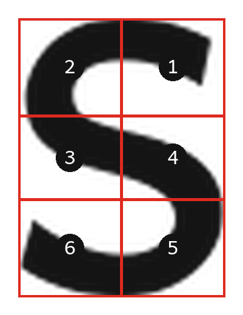

Start top right, over the top, down the left, across the middle, down the right, along the bottom to the left.

## t — 6 zones, 2 strokes

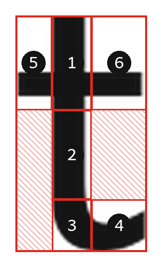

Stroke one: down the stem, curving right at the foot. Stroke two: the crossbar, left to right.

## u — 5 zones, 1 stroke

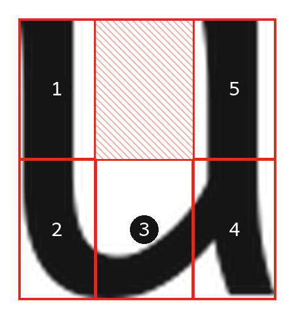

Down the left, round the bottom, up the right.

## v — 4 zones, 1 stroke

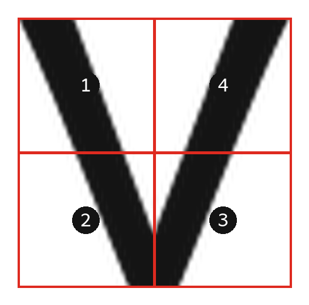

Down from the top left to the point, back up to the top right.

## w — 5 zones, 1 stroke

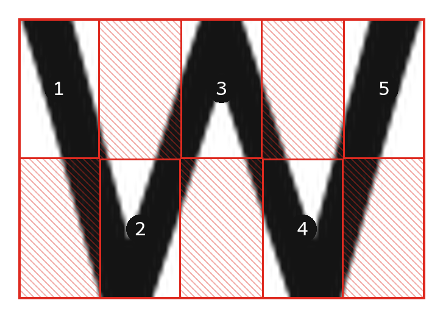

Down, up, down, up - left to right.

## x — 5 zones, 2 strokes

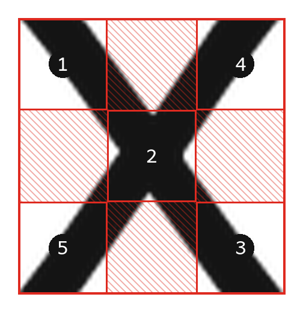

Stroke one: top left through the middle to bottom right. Stroke two: top right to bottom left.

## y — 5 zones, 2 strokes

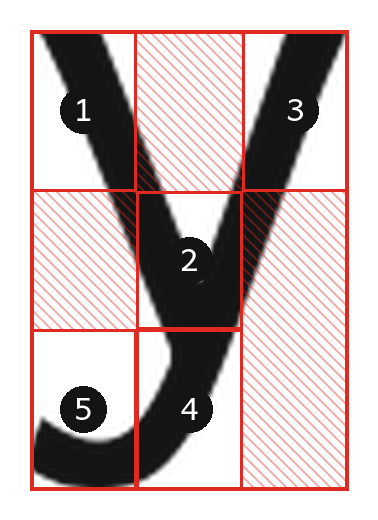

Stroke one: short arm, top left down to the join. Stroke two: top right down through the join into the tail, curling left.

## z — 5 zones, 1 stroke

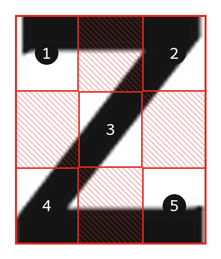

Across the top, diagonal down to the left, across the bottom.
