# Letter zones as ragged grids — for review

Every letter below has been redrawn so that its zones follow one simple rule,
which we are calling a **ragged grid**:

* You pick a handful of dividing lines for the letter — some up-and-down, some
  left-to-right.
* Every zone is a box whose four sides sit on those lines (or on the outside
  edge of the letter).
* No two zones may overlap.
* A dividing line does not have to run the whole way across. One column of the
  letter can be cut into different rows from the column next to it. That is
  what makes it *ragged* rather than a plain chessboard.
* Anywhere no zone claims is left blank and shows up in the pictures as red
  diagonal shading. Those are "don't care" areas: the pen may go there, it just
  does not have to.

A new checker in `scripts/glyph_sections.py` now enforces this on every run. It
refuses the design and reports which zones are at fault if two zones overlap,
if a zone edge floats out of line with everything else, if a zone has
essentially no letter in it, or if the zone numbers are not a clean 1, 2, 3…
run. `--check-only` runs the checks without drawing pictures.

---

## Read this first

### Anything that could not be made to work

Nothing. All 22 letters asked for were completed and all 22 pass the checker:

**i j k l m o p q r s t u v w x y z** (the 17 rewritten proposals) and
**a b c d e** (the five that were previously overlapping).

The letter **g**, which was given as the worked example, was left exactly as it
was and still passes.

### Letters where I think the stroke order needs a second look

These are not errors in the boxes — the boxes match the sequence each letter was
already given. They are places where I think the *sequence itself* deserves a
human decision.

1. **o and a — where does the stroke start?**
   Both letters are described as starting "at the top", and their first zone is
   placed across the top-middle of the letter. But the app's own starting box
   for each of them (in `lib/models/letter_formation_registry.dart`) sits over
   the **top right**, not the top middle. A learner who starts at the far right
   of the box the app shows them begins just outside zone 1. In practice the
   sequence still works — they enter zone 1 a moment later as they sweep left —
   but the two pieces of guidance disagree about where "the top" is, and
   somebody should decide which is right. I have not changed either one.

2. **m — is the stem retraced?**
   The written sequence for m says the pen goes down the first leg, then
   *retraces back up the same leg* before going over the first arch, and again
   for the second arch. That is one recognised way of teaching m, but it is not
   the only one, and it is the assumption the six zones are built on. If your
   teaching model is "one stroke down, then over, then over" without retracing,
   the zones still work, but the description in the file should be reworded.

3. **c — three zones, not four.**
   The reference document describes c with four zones (a quarter each). The app
   actually has three. I kept three, as instructed, so c gets a slightly
   coarser check than its write-up implies.

4. **b and d — the app and the document disagree.**
   The reference document describes b and d as tidy three-column grids. What is
   actually in the app is a different, looser arrangement. I have followed what
   is in the app (six zones each, same stroke order), not the document. The
   document will need updating either way.

### One thing to know about the checker

Run against the letters that are already live in the app, the checker passes
**f, g, h and n** and fails **a, b, c, d and e** — which is exactly the problem
this work was asked to fix. The five replacement designs in `proposals/` all
pass. Nothing under `lib/` or `test/` was touched, so the app behaves today
exactly as it did before; these are proposals for a human to transcribe.

---

## The letters

Each section names the picture, describes the stroke in plain English, and
gives the number of zones. The numbers in the pictures are the order the pen
must pass through them.

---

### a — 6 zones, 1 stroke
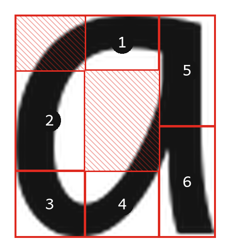

One continuous stroke. Start at the top of the round part (1), sweep left and
down the left-hand side (2), round the bottom-left corner (3), along the bottom
and up to close the circle (4), then up the straight back of the letter (5) and
back down it to finish (6).

*Judgement calls.* The old version of this letter had **five pairs of
overlapping zones** — the worst in the set. Everything is redrawn. Going up the
stem and back down means the pen passes through zone 6 on its way to zone 5;
that is fine, because the checker only asks that zone 5 is reached before zone 6
*is counted*, and the pen comes back down through 6 afterwards. The hollow
middle of the letter and the top-left of the curve are deliberately left
unclaimed.

---

### b — 6 zones, 2 strokes
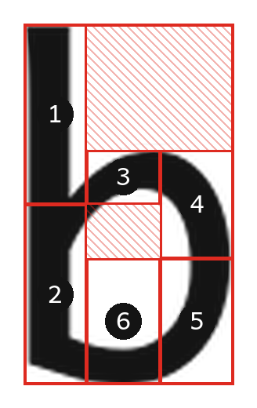

**Stroke one:** the long straight back, top to bottom (1 then 2).
**Stroke two:** the round bowl, drawn clockwise — out from the stem (3), down
the right-hand side (4), round the bottom-right (5), and back along the bottom
to the stem (6).

*Judgement calls.* Zone 3 is a short, wide band rather than a square, because
that is the only part of the upper bowl that is reliably inked in this typeface.
Zone 6 is mostly empty space with the bottom of the bowl running through its
lower edge — that is expected for a bowl shape and it still holds plenty of ink.

---

### c — 3 zones, 1 stroke
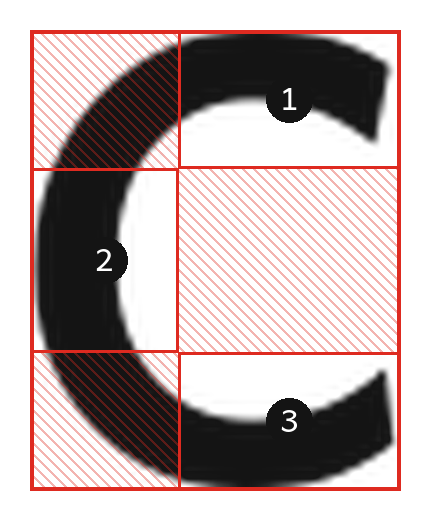

One stroke. Start at the top right (1), sweep left over the top and down the
left-hand side (2), then along the bottom and out to the right to finish (3).

*Judgement calls.* Only three zones, to match what the app already has. The
whole open mouth of the c on the right is left unclaimed, which is correct —
there is no ink there and the pen must never go through it.

---

### d — 6 zones, 2 strokes
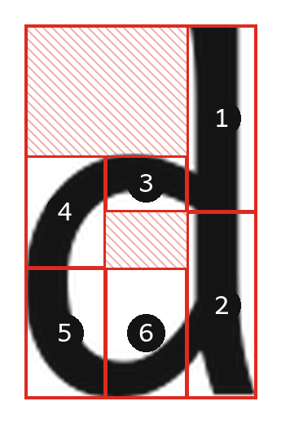

**Stroke one:** the long straight back on the right, top to bottom (1 then 2).
**Stroke two:** the round bowl, drawn anticlockwise — out from the stem (3),
down the left-hand side (4), round the bottom-left (5), and back along the
bottom to the stem (6).

*Judgement calls.* d is laid out as the mirror image of b, using the same
dividing lines flipped left-to-right, so the two letters stay comparable.

---

### e — 7 zones, 1 stroke
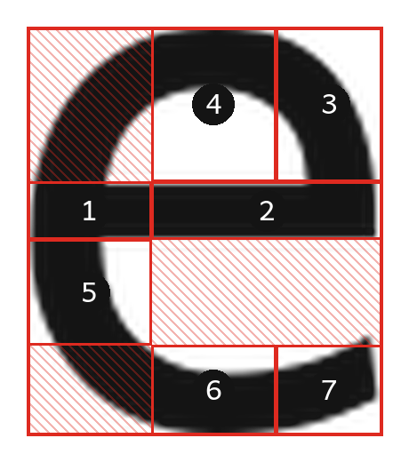

One stroke. Start at the left-hand end of the crossbar and travel right along
it (1 then 2), curve up to the top right (3), sweep left over the top (4), down
the left-hand side (5), along the bottom (6), and finish with the little open
tail at the bottom right (7).

*Judgement calls.* In the old version, one tall zone covered the whole left-hand
side from top to bottom — but the crossbar zone sat inside it, so the two
overlapped. Since zones may no longer overlap, the left-hand side is now checked
**below** the crossbar only (zone 5). The part above the crossbar on the left is
left unclaimed. Nothing is lost: to reach zone 5 from zone 4 the pen has to come
down that way anyway.

---

### i — 3 zones, 2 strokes
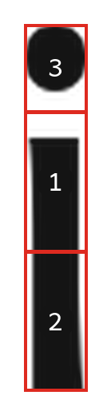

**Stroke one:** the stem, top half then bottom half (1 then 2) — this is what
catches a learner drawing upwards.
**Stroke two:** the dot (3).

*Judgement calls.* The dot's band now reaches down to meet the top of the stem
band rather than stopping just under the dot. That leaves no gap between the
two, which the ragged-grid rule requires, and it makes the dot slightly easier
to hit.

---

### j — 4 zones, 2 strokes
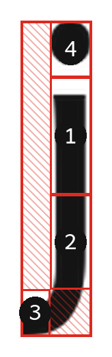

**Stroke one:** down the stem, upper half then lower half (1 then 2), then the
hook curling away to the left at the very bottom (3).
**Stroke two:** the dot (4).

*Judgement calls.* The area directly below the stem is deliberately left
unclaimed, so the learner is not forced to press down into it before the hook
turns left. Only the left-hand part of the bottom counts as the hook.

---

### k — 5 zones, 2 strokes
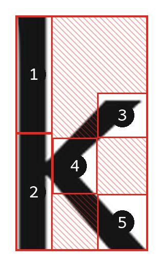

**Stroke one:** the tall straight back, top to bottom (1 then 2).
**Stroke two:** the arm, coming in from the upper right (3), into the join
against the stem (4), then back out to the lower right to finish (5).

*Judgement calls.* The arm and the leg are treated as one continuous second
stroke, as the file already described. The join zone (4) is the narrow box in
the middle — that is what stops a learner drawing two unconnected ticks.

---

### l — 3 zones, 1 stroke
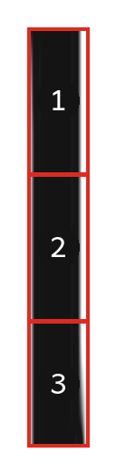

One stroke straight down: top third, middle third, bottom third (1, 2, 3).

*Judgement calls.* None. This letter was already a valid ragged grid and is
unchanged.

---

### m — 6 zones, 1 stroke
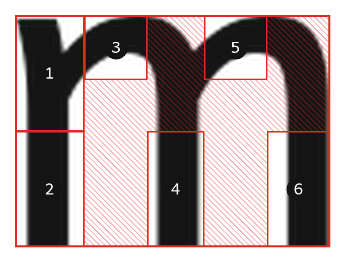

One continuous stroke. Down the first leg (1 then 2), back up and over the first
arch (3), down the second leg (4), back up and over the second arch (5), down
the third leg (6).

*Judgement calls.* Unchanged — it was already a valid ragged grid. The two arch
zones (3 and 5) sit on the *rising* side of each arch rather than dead centre on
the peak. That is deliberate: it means the learner has to actually travel up and
over, not just touch the top. See also the stroke-order note about retracing,
above.

---

### o — 6 zones, 1 stroke
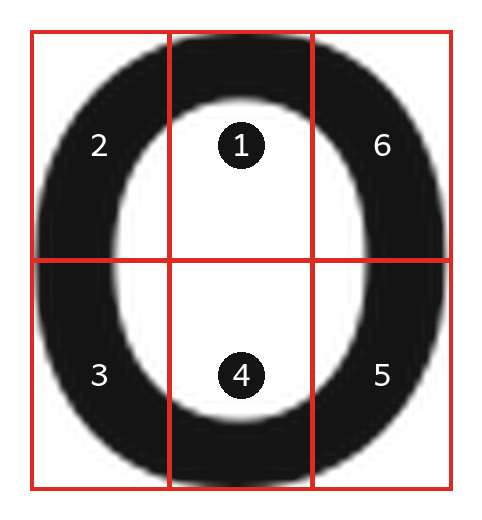

One stroke, anticlockwise all the way round: start at the top (1), upper left
(2), lower left (3), bottom (4), lower right (5), and back up the right-hand
side to close the ring (6).

*Judgement calls.* This is the one letter that came out as a plain, fully-filled
grid — three columns by two rows, nothing left over. A ring passes through all
six boxes in turn, so there is nothing to leave unclaimed. The old version gave
each column its own row lines, which did not line up. See the stroke-order note
about where o starts, above.

---

### p — 5 zones, 2 strokes
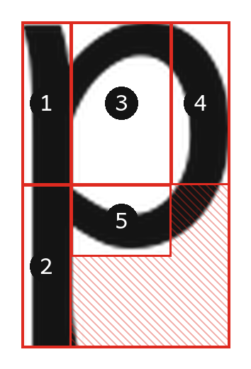

**Stroke one:** the stem, straight down and on below the line (1 then 2).
**Stroke two:** the bowl, clockwise — out across the top from the stem (3), down
the right-hand side (4), and back along the bottom to the stem (5).

*Judgement calls.* Zone 3 is a large box that includes the hollow middle of the
bowl. That is more generous than it looks: the only way into it from the stem is
across the top, and the bitmap checks handle whether the shape itself is right.
The empty bottom-right quarter of the letter is left unclaimed.

---

### q — 6 zones, 2 strokes
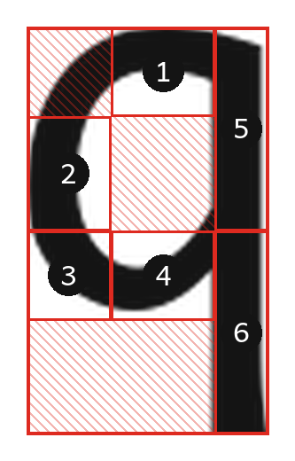

**Stroke one:** the oval, anticlockwise — top (1), upper left (2), lower left
(3), along the bottom (4).
**Stroke two:** the straight descender on the right, top to bottom (5 then 6).

*Judgement calls.* The oval's four zones share their dividing lines across the
letter, and the descender column only uses the halfway line. The empty space
below the oval on the left is left unclaimed.

---

### r — 4 zones, 2 strokes
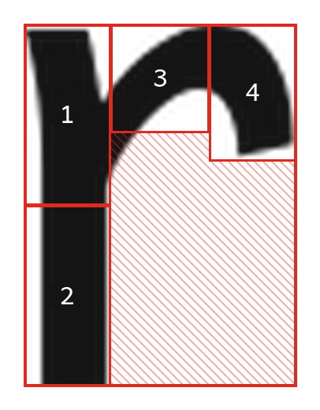

**Stroke one:** the stem, top to bottom (1 then 2).
**Stroke two:** the shoulder, rising out of the stem (3) and curving over to the
tip on the right (4).

*Judgement calls.* Unchanged — already a valid ragged grid. The whole
bottom-right of the letter is empty and stays unclaimed.

---

### s — 7 zones, 1 stroke
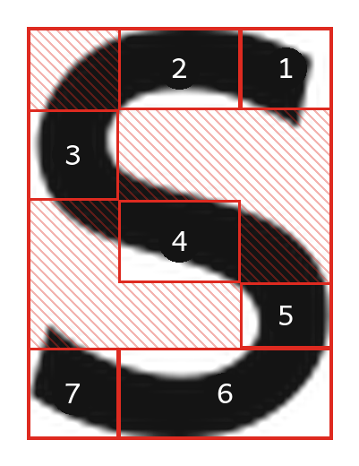

One stroke. Start at the top right (1), sweep left over the top (2), down the
left-hand side (3), across the middle on the diagonal (4), down the right-hand
side (5), along the bottom (6) and out to the left to finish (7).

*Judgement calls.* The old version had zones 5 and 6 overlapping. Everything is
rebuilt on two up-and-down lines and a stack of row lines, so each step of the S
drops cleanly onto the next. The two big hollows of the S are left unclaimed,
which is what gives the letter its distinctive staircase of boxes.

---

### t — 5 zones, 2 strokes
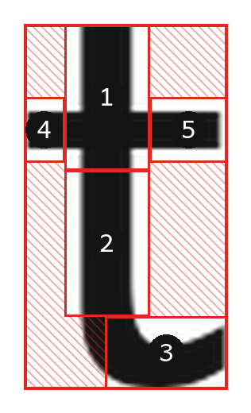

**Stroke one:** down the stem (1 then 2), then the little foot curving away to
the right at the bottom (3).
**Stroke two:** the crossbar, left to right (4 then 5).

*Judgement calls.* Unchanged — already a valid ragged grid. The crossbar is
checked at its two ends only; the middle of the crossbar is where it meets the
stem, so requiring it would not prove anything.

---

### u — 5 zones, 1 stroke
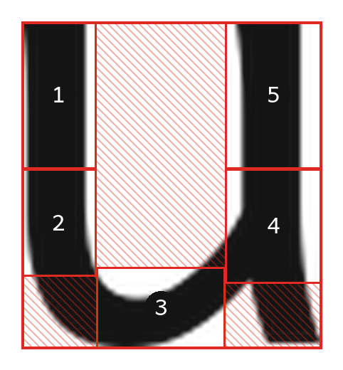

One stroke. Down the left leg (1 then 2), round the bottom curve (3), then up
the right leg (4 then 5) to finish at the top right.

*Judgement calls.* Unchanged — already a valid ragged grid. Splitting each leg
in two is what proves the direction of travel.

---

### v — 5 zones, 1 stroke
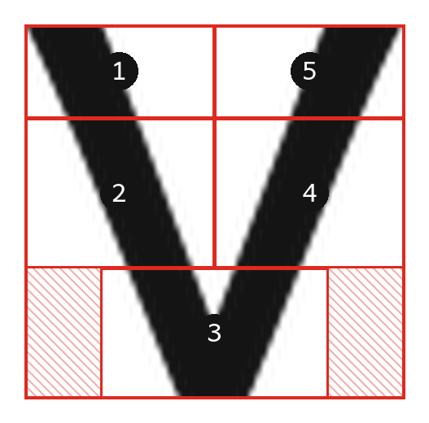

One stroke. Start at the top left (1), down the left diagonal (2), through the
point at the bottom (3), back up the right diagonal (4), finishing at the top
right (5).

*Judgement calls.* The old version used five separate boxes tilted along the
diagonals, none of which lined up with each other. The new version uses a single
up-and-down line down the middle, which is enough: the left arm is always left
of it and the right arm always right of it. The point at the bottom gets its own
wide band, with the two empty bottom corners left unclaimed.

---

### w — 5 zones, 1 stroke
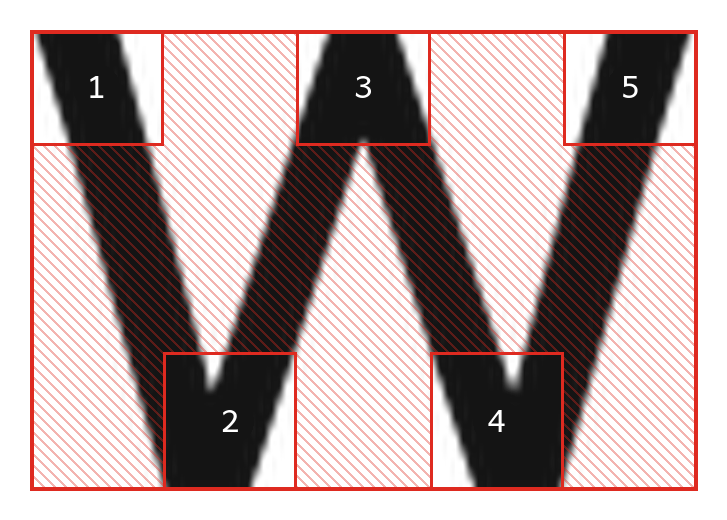

One stroke, two joined v shapes. Start at the top left (1), down to the first
point (2), up to the middle peak (3), down to the second point (4), up to finish
at the top right (5).

*Judgement calls.* Five equal columns. Peaks are checked in the top band, valley
points in the bottom band, and the whole middle of the letter is left unclaimed
— the pen's exact path between a peak and a valley does not matter, only that it
gets there. This is the letter with the most shading in its picture, and that is
correct.

---

### x — 5 zones, 2 strokes
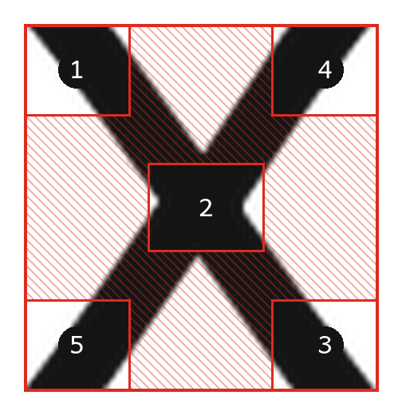

**Stroke one:** the first diagonal, from the top left (1), through the crossing
point in the middle (2), down to the bottom right (3).
**Stroke two:** the second diagonal, from the top right (4) down to the bottom
left (5).

*Judgement calls.* Unchanged — already a valid ragged grid. The crossing box in
the middle is an island with open space on all four sides, which the ragged-grid
rule allows. Only the first stroke is required to pass through it; adding it to
the second stroke as well would not catch any extra mistakes.

---

### y — 6 zones, 2 strokes
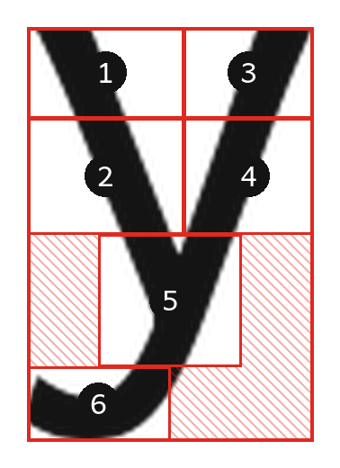

**Stroke one:** the short left arm, from the top left (1) down to the join (2).
**Stroke two:** the long right arm, from the top right (3) down through the join
(4), on down into the tail (5), and curling away to the left to finish (6).

*Judgement calls.* The old version had the two arms' boxes overlapping each
other, and the tail overlapping its own finish. Everything above the join is now
split down the middle at just past halfway, which is where the real ink shows
the two arms still clearly apart. Below the join the tail gets its own narrower
boxes with the corners left unclaimed.

---

### z — 5 zones, 1 stroke
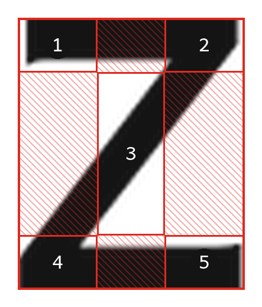

One stroke. Across the top bar, left to right (1 then 2), down the diagonal
(3), then across the bottom bar, left to right (4 then 5).

*Judgement calls.* The diagonal gets the whole middle column to itself, top to
bottom, so the learner is checked on travelling down through the middle of the
letter without being told exactly where. The bars are checked at both ends,
which proves the left-to-right direction of each.

---

### g — 8 zones, 1 stroke (reference example, unchanged)
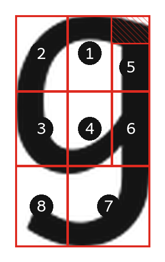

Included for comparison only; this was the worked example the rest were built
from. The top-right corner above zone 5 is unclaimed, which is the clearest
illustration of a dividing line that does not run the full height.
